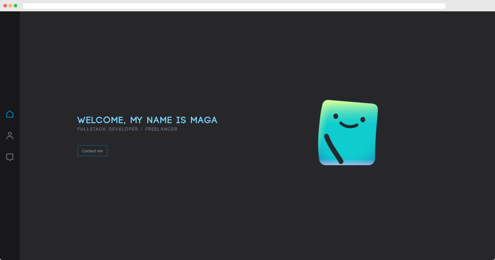

<h1 style="text-align: center">Portfolio</h1>
<p style="text-align: center">NextJS 12 / Tailwindcss / TypeScript</p>

## Usage

Run portfolio inside a docker container

If you want to expose a different port, edit <a href="docker-compose.yml">docker-compose.yml</a>

```bash
# run production build
$ docker-compose up -d

# run production build (with rebuild in case of new changes)
$ docker-compose up -d --build

# view docker logs
$ docker-compose logs -t -f

# close docker process
$ docker-compose down
```

## Development

```bash
# switch to working directory
$ cd frontend/

# install neccessary dependencies
$ yarn install

# run application in dev mode port :3000
$ yarn dev
```


## Licensing

Distributed under the MIT License. See [LICENSE](LICENSE.md) for more information.
